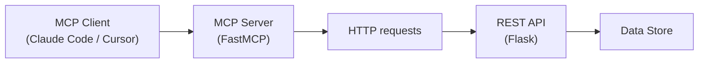
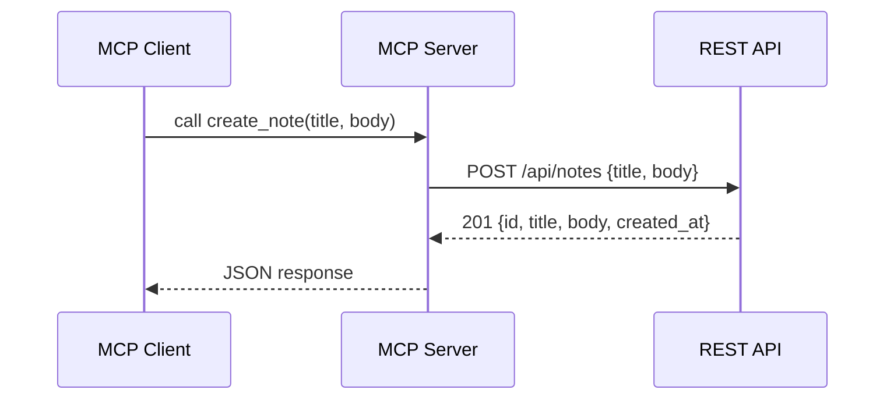

# Exposing a REST API Through MCP: Turning Any API into an AI Tool

Most organizations already have REST APIs. They power internal dashboards, connect microservices, expose data to mobile apps. They work. But now you want an AI agent to use those same services, and agents don't speak REST. They speak MCP. Do you rewrite everything? No. You build a thin adapter layer that translates between the two protocols, and your existing API stays untouched.

That's exactly what this project does. We take a standard Flask REST API and wrap it with an MCP server using FastMCP. Any MCP-compatible client, Claude Code, Cursor, Windsurf, Amazon Q, can discover and call the API endpoints as tools, without knowing there's a REST layer underneath.



## The REST API

The API is a standard Flask application with CRUD endpoints for managing notes. Nothing special here, just the kind of REST service you'd find in any organization:

```python
notes_bp = Blueprint("notes", __name__)


@notes_bp.route("/api/notes", methods=["GET"])
def list_notes():
    return jsonify(get_all_notes())


@notes_bp.route("/api/notes/<int:note_id>", methods=["GET"])
def read_note(note_id: int):
    note = get_note(note_id)
    if note is None:
        return jsonify({"error": "Note not found"}), 404
    return jsonify(note)


@notes_bp.route("/api/notes", methods=["POST"])
def add_note():
    data = request.get_json()
    if not data or "title" not in data:
        return jsonify({"error": "title is required"}), 400
    note = create_note(title=data["title"], body=data.get("body", ""))
    return jsonify(note), 201


@notes_bp.route("/api/notes/<int:note_id>", methods=["PUT"])
def edit_note(note_id: int):
    data = request.get_json()
    note = update_note(note_id, title=data.get("title"), body=data.get("body"))
    if note is None:
        return jsonify({"error": "Note not found"}), 404
    return jsonify(note)


@notes_bp.route("/api/notes/<int:note_id>", methods=["DELETE"])
def remove_note(note_id: int):
    if delete_note(note_id):
        return jsonify({"status": "deleted"})
    return jsonify({"error": "Note not found"}), 404
```

Five endpoints: list, get, create, update, delete. The data store is an in-memory dictionary for simplicity, but in a real scenario this would be your existing database, your internal service, your legacy system. The point is that the REST API already exists and works. We don't want to change it.

## The MCP server

This is the core of the project. The MCP server uses [FastMCP](https://gofastmcp.com/) to expose each REST endpoint as an MCP tool. It uses `requests` to call the Flask API over HTTP:

```python
import requests
from mcp.server.fastmcp import FastMCP

from settings import API_BASE_URL

mcp = FastMCP(name="notes-api")

BASE = API_BASE_URL


@mcp.tool()
def list_notes() -> str:
    """List all notes stored in the system.

    Returns a JSON array of note objects, each containing:
    id, title, body, and created_at fields.
    """
    response = requests.get(f"{BASE}/api/notes")
    return response.text


@mcp.tool()
def get_note(note_id: int) -> str:
    """Get a single note by its ID.

    Returns the note object with id, title, body, and created_at fields.
    Returns an error if the note is not found.
    """
    response = requests.get(f"{BASE}/api/notes/{note_id}")
    return response.text


@mcp.tool()
def create_note(title: str, body: str = "") -> str:
    """Create a new note.

    Args:
        title: The title of the note (required).
        body: The body content of the note (optional, defaults to empty string).

    Returns the created note object with its assigned id.
    """
    response = requests.post(
        f"{BASE}/api/notes",
        json={"title": title, "body": body},
    )
    return response.text


@mcp.tool()
def update_note(note_id: int, title: str = "", body: str = "") -> str:
    """Update an existing note by its ID.

    Args:
        note_id: The ID of the note to update.
        title: New title for the note (optional, send empty string to keep current).
        body: New body for the note (optional, send empty string to keep current).

    Returns the updated note object, or an error if not found.
    """
    payload = {}
    if title:
        payload["title"] = title
    if body:
        payload["body"] = body
    response = requests.put(
        f"{BASE}/api/notes/{note_id}",
        json=payload,
    )
    return response.text


@mcp.tool()
def delete_note(note_id: int) -> str:
    """Delete a note by its ID.

    Args:
        note_id: The ID of the note to delete.

    Returns a status confirmation or an error if the note is not found.
    """
    response = requests.delete(f"{BASE}/api/notes/{note_id}")
    return response.text


if __name__ == "__main__":
    mcp.run()
```

Each `@mcp.tool()` maps to one REST endpoint. The decorator extracts parameter types from the function signature to build the JSON schema that MCP clients use to understand what parameters to send. The docstring becomes the tool description that the AI agent reads to decide when and how to call each tool. When you run `python src/server/main.py`, it starts listening on stdio for MCP requests.

The pattern is straightforward: receive the MCP call, translate it into an HTTP request, forward it to the REST API, and return the response. The MCP server knows nothing about the business logic. The REST API knows nothing about MCP. Each side does its job.

## The adapter pattern

This is the **Adapter Pattern** applied at the protocol level. The MCP server adapts the REST interface into the MCP protocol. The REST API doesn't need to change. The MCP client doesn't need to know it's talking to a REST service. The adapter handles the translation:



The MCP client calls `create_note("Meeting notes", "Discussed Q3 roadmap")`. The MCP server translates this into a `POST /api/notes` with a JSON body. The Flask API processes it, creates the note, and returns the result. The MCP server passes the response back to the client. The agent sees a tool that creates notes. It doesn't know or care that there's an HTTP call in between.

## Configuration

To use the MCP server from Claude Code, create a `.mcp.json` file in your project root:

```json
{
  "mcpServers": {
    "notes-api": {
      "command": "/path/to/venv/bin/python",
      "args": ["/path/to/src/server/main.py"]
    }
  }
}
```

Claude Code reads this file, launches the MCP server as a subprocess, performs the MCP handshake, and discovers the five tools automatically. The same server works with Cursor, Windsurf, VS Code with Copilot, or any other MCP-compatible client, just point it to the same Python script.

## Running it

First, install dependencies:

```bash
poetry install
```

Start the Flask API in one terminal:

```bash
make api
```

You can verify it works with curl:

```bash
curl -X POST http://127.0.0.1:5000/api/notes \
  -H "Content-Type: application/json" \
  -d '{"title": "First note", "body": "Hello from REST"}'

curl http://127.0.0.1:5000/api/notes
```

With the API running and `.mcp.json` in place, open Claude Code in the project directory. It discovers the `notes-api` MCP server and makes all five tools available. You can ask things like "Create a note about the deployment we did today" or "List all my notes" and the agent calls the MCP tools, which call your REST API, automatically.

## Taking it further

This POC uses a simple notes API, but the same pattern works with any existing REST service. Your internal APIs, third-party integrations, legacy systems, anything with HTTP endpoints can be wrapped with a thin MCP layer. The REST API stays unchanged, the MCP server handles the translation, and suddenly your existing services become tools that any AI agent can use.

You could also add authentication headers in the MCP server (forwarding API keys or tokens to the REST API), error handling with retry logic, or caching for read-heavy endpoints. The adapter layer is the right place for these cross-cutting concerns.

And that's all. With a thin MCP adapter on top of any REST API, your existing services become tools that any AI agent can discover and use. The REST API stays unchanged, the MCP server handles the protocol translation, and the standard connects them. Build the adapter once, use it from any MCP client.

Full code in my [github](https://github.com/gonzalo123/rest2mcp) account.
